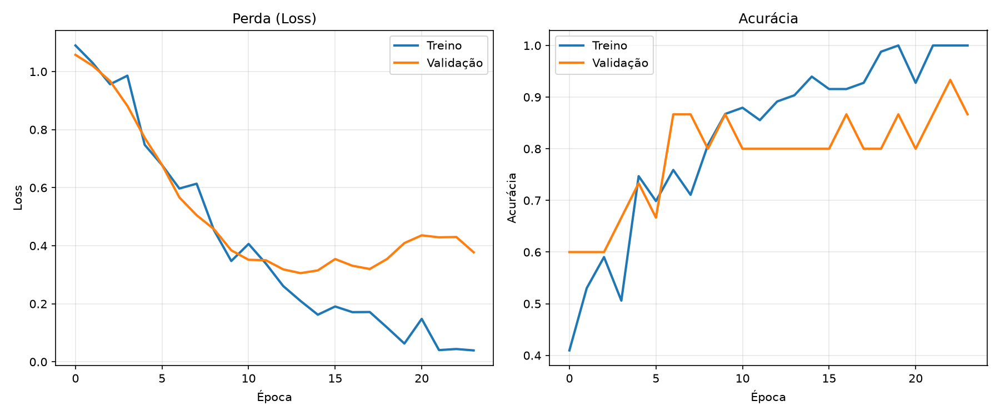

# 📸 Classificador de Imagens com CNN

**Projeto acadêmico** — Classificador de objetos do cotidiano usando uma **Rede Neural Convolucional (CNN)** treinada do zero, com reconhecimento ao vivo via webcam.



> *Treinamento por 50 épocas com EarlyStopping. Melhor época: 14. Acurácia no teste: **92%**.*

---

## 🎯 Objetivo

Construir, do zero, um classificador de imagens próprio que:

1. Monta um dataset com fotos reais
2. Treina uma Rede Neural Convolucional (CNN)
3. Reconhece objetos **ao vivo** pela webcam

---

## 📦 Classes

| Classe | Pasta | Fotos | Exemplo |
|--------|:-----:|:-----:|:-------:|
| 🖱️ **Mouse** | `Imagens/0/` | 41 | Mouse de computador, vários ângulos |
| 📖 **Livro** | `Imagens/1/` | 41 | Livros, capas e páginas visíveis |
| 🎮 **Controle** | `Imagens/2/` | 41 | Controles de videogame |

**Total:** 123 imagens, todas tiradas com a **webcam** no mesmo ambiente do reconhecimento, **com a mão aparecendo** segurando o objeto.

---

## 🧠 Como a CNN Aprende

### O que é uma CNN?

Uma Rede Neural Convolucional (CNN) é um tipo de rede artificial especializada em **reconhecer padrões visuais**. Diferente de uma rede comum, ela não enxerga a imagem como um único vetor gigante — ela **varre a imagem em pequenos pedaços**, aprendendo padrões locais.

### Pipeline de aprendizado

```
ENTRADA (32×32 cinza)
    │
    ▼
┌──────────────────────────────────────────┐
│         CAMADAS CONVOLUCIONAIS           │
│                                          │
│  Conv2D (16 filtros) + ReLU              │
│  │   Aprende padrões simples: bordas,    │
│  │   cantos, texturas básicas            │
│  ▼                                       │
│  MaxPooling (2×2) → reduz à metade       │
│  │   Mantém só o mais importante         │
│  ▼                                       │
│  Conv2D (32 filtros) + ReLU              │
│  │   Aprende padrões médios: curvas,     │
│  │   combinações de bordas               │
│  ▼                                       │
│  MaxPooling (2×2) → reduz à metade       │
│  ▼                                       │
│  Conv2D (64 filtros) + ReLU              │
│  │   Aprende padrões abstratos:          │
│  │   formato de botão, contorno de livro │
│  ▼                                       │
│  MaxPooling (2×2) → reduz a 4×4          │
└──────────────────────────────────────────┘
    │
    ▼
┌──────────────────────────────────────────┐
│         CLASSIFICADOR                    │
│                                          │
│  Flatten → achata 4×4×64 em vetor        │
│  Dense (128 neurônios) + ReLU            │
│  Dropout (50%) → desliga metade          │
│      (evita decorar as fotos)            │
│  Dense (3 neurônios) + Softmax           │
│      → Decide: mouse, livro ou controle? │
└──────────────────────────────────────────┘
    │
    ▼
SAÍDA: ["mouse", "livro", "controle"]
```

### Como o treino funciona

1. **Forward:** A imagem passa pela rede, camada por camada. Cada neurônio calcula uma soma ponderada e aplica uma função de ativação (ReLU). No final, o Softmax dá a probabilidade para cada classe.

2. **Cálculo do erro:** A função `sparse_categorical_crossentropy` compara a saída da rede com o rótulo correto. Se o modelo disse "70% mouse" mas era livro, o erro é grande.

3. **Backpropagation:** O erro "volta" pela rede, ajustando os pesos de cada neurônio na direção que reduz o erro. O otimizador **Adam** controla esse ajuste.

4. **Repetir:** Cada época (passada completa pelo dataset) refina os pesos. O **EarlyStopping** monitora a perda na validação e para quando o modelo começa a decorar (overfitting).

### Pré-processamento

Toda foto passa por esse pipeline antes de entrar na rede:

```
Foto original (qualquer tamanho, colorida)
    │
    ▼
Escala de cinza (cv2.cvtColor)
    │  Reduz 3 canais (RGB) para 1 canal
    ▼
Redimensionar para 32×32 (cv2.resize)
    │  Padroniza todas as imagens
    ▼
Equalização de histograma (cv2.equalizeHist)
    │  Corrige iluminação — realça contraste
    ▼
Normalizar: dividir pixels por 255.0
    │  Converte 0-255 para 0.0-1.0
    │  (redes neurais aprendem melhor com números pequenos)
    ▼
Adicionar dimensão de canal: (32, 32) → (32, 32, 1)
    │
    ▼
Pronto para a CNN!
```

### Divisão dos dados

| Conjunto | Imagens | % | Função |
|----------|:-------:|:-:|--------|
| **Treino** | 83 | 67% | Onde o modelo aprende os padrões |
| **Validação** | 15 | 12% | Monitora se está decorando (overfitting) |
| **Teste** | 25 | 20% | Avaliação final — o modelo NUNCA viu essas |

O `stratify=True` garante que a proporção de classes é mantida em cada divisão.

---

## 🧪 Lições Aprendidas

### O que deu errado (e por que)

1. **Copo transparente:** Em 32×32 cinza, o copo de vidro simplesmente sumia no fundo. O modelo aprendia a reconhecer o fundo, não o copo.

2. **Domain shift:** As primeiras fotos foram tiradas numa mesa; o reconhecimento ao vivo era na mão, em outro ambiente. O modelo nunca tinha visto "mão + objeto" — foi como aprender a reconhecer leões em fotos de zoológico e ser solto no Serengeti.

3. **Mouse parecia controle:** Os dois objetos têm formato alongado, botões, cor escura. Em 32×32, as silhuetas são quase idênticas.

### O que resolveu

- Tirar as fotos **com a mão aparecendo** no mesmo local da webcam
- Manter escala de cinza + equalização (funcionou melhor que RGB)
- Treinar com fotos variadas (ângulos, distâncias, iluminações)

---

## 🛠️ Como usar

### 1. Instalar dependências

```bash
pip install tensorflow opencv-python scikit-learn matplotlib numpy
```

### 2. Capturar novas fotos

```bash
python webcam.py 0   # Captura mouse   (salva em Imagens/0/)
python webcam.py 1   # Captura livro   (salva em Imagens/1/)
python webcam.py 2   # Captura controle (salva em Imagens/2/)
```

Comandos dentro da janela: `[ENTER]` captura a foto, `[P]` sai.

### 3. Treinar

```bash
python treino.py
```

Gera o arquivo `modelo.h5` e o gráfico `grafico_treino.png`.

### 4. Reconhecer ao vivo

```bash
python reconhecimento.py
```

Aponta os objetos pra webcam e vê a classificação em tempo real. `[Q]` para sair.

---

## 📁 Estrutura do Repositório

```
classificador-cnn/
│
├── webcam.py              # Captura de fotos pela webcam
├── carregar_dados.py      # Carrega, pré-processa e divide os dados
├── treino.py              # Constrói e treina a CNN
├── reconhecimento.py      # Reconhecimento ao vivo
│
├── modelo.h5              # Modelo treinado (ignorado pelo git)
├── grafico_treino.png     # Gráfico loss × accuracy do treino
│
├── Imagens/               # Dataset (ignorado pelo git)
│   ├── 0/   (mouse)
│   ├── 1/   (livro)
│   └── 2/   (controle)
│
├── .hermes/plans/         # Checkpoints de sessão
├── README-aula01.md       # Anotações da primeira aula
└── README.md              # Este arquivo
```

---

## 📊 Resultados Finais

| Métrica | Valor |
|---------|:-----:|
| Acurácia no teste | **92%** |
| Loss no teste | 0.189 |
| Total de parâmetros | 154.883 |
| Arquitetura | 3x Conv2D + Dense + Dropout |
| Pré-processamento | Cinza + equalização + 32×32 |
| Dataset | 123 fotos (41 por classe) |

---

## 📚 Referências

- LeCun et al. (1998) — *"Gradient-Based Learning Applied to Document Recognition"* (LeNet-5)
- Documentação Keras: `Conv2D`, `MaxPooling2D`, `Sequential`
- PyImageSearch (Adrian Rosebrock) — Tutoriais de CNN com Keras
- Goodfellow, Bengio, Courville — *"Deep Learning"*, Cap. 7 (regularização)

---

*Projeto desenvolvido como exercício prático de Visão Computacional e Deep Learning.*
